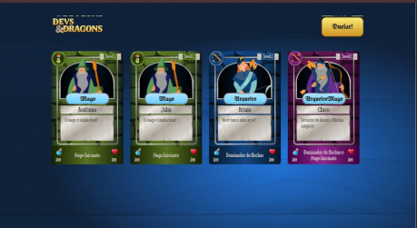

<h1 style="text-align: center">DEVS & DRAGONS</h1>
<h2> 📰 Sobre</h2>
Projeto de treinamento do curso de Front-end da Alura.

## JavaScript: classes e heranças no desenvolvimento de aplicações com o paradigma de Orientação a Objetos

- Pilares da programação orientada a objetos:

   - Classes
   - Herança
   - Encapsulamento
   - Polimorfismo
   - Composição

<h2> 🚀 Tecnologias</h2>

 
    
    
    

<h2> 📞 Contato</h2>

  
  

  

  

 
  <h2>Link do Projeto</h2>
  

